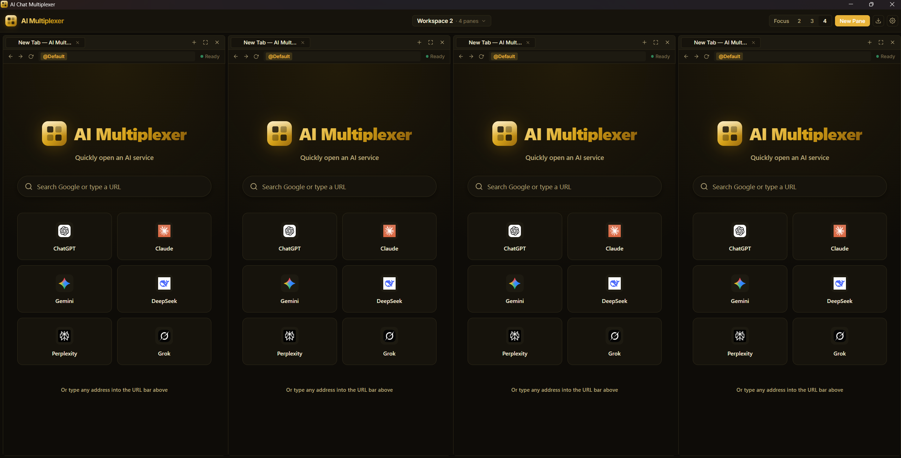

# AI Chat Multiplexer

Không gian làm việc desktop local-first để chạy nhiều ứng dụng AI web cạnh nhau, đồng thời giữ dự án và phiên trình duyệt ngăn nắp.

[](https://github.com/hoan9an/ai-chat-multiplexer/releases/latest)
[](https://github.com/hoan9an/ai-chat-multiplexer/actions/workflows/ci.yml)
[](./LICENSE)

Ngôn ngữ: [English](./README.md) · [Tiếng Việt](./README.vi.md) · [中文](./README.zh.md)



[Tải bản mới nhất](https://github.com/hoan9an/ai-chat-multiplexer/releases/latest) · [Vấn đề đã biết](./docs/support/known-issues.md) · [Build từ mã nguồn](#build-từ-mã-nguồn)

## Vì sao nên dùng?

Công việc với AI thường trải rộng trên nhiều model, tài khoản và dự án. AI Chat Multiplexer gom các workflow đó vào một cửa sổ desktop nhưng không trộn chúng vào cùng một phiên trình duyệt.

| Nhu cầu | Ứng dụng cung cấp |
|---|---|
| So sánh model | Đặt nhiều dịch vụ AI ở các pane cạnh nhau. |
| Sắp xếp dự án | Lưu pane và tab trong từng workspace riêng. |
| Tách tài khoản | Mỗi profile có cookie, storage, cache và phiên đăng nhập riêng. |
| Làm việc song song | Để tác vụ dài tiếp tục chạy trong khi dùng pane khác. |
| Mở dịch vụ chặn iframe | Hiển thị website ngoài bằng native child webview của Tauri thay vì iframe thông thường. |

## Khả năng chính

- Workspace có layout pane và trạng thái tab độc lập.
- Focus mode và layout từ một đến bốn cột, hỗ trợ kéo thả pane.
- Tab có thể sắp xếp lại, tách thành pane mới hoặc chuyển giữa các pane cùng profile.
- Tách phiên trình duyệt theo profile bằng data directory riêng của Tauri webview.
- Download native, điều phối cửa sổ mới, kiểm tra cập nhật và chẩn đoán cục bộ đã lược bỏ dữ liệu nhạy cảm.
- Onboarding tùy chọn và workflow mẫu cho so sánh, review code và nghiên cứu.
- Giao diện tiếng Anh, tiếng Việt và tiếng Trung.

Giao diện React quản lý mô hình workspace và layout. Backend Rust/Tauri quản lý native child webview, thư mục session theo profile, download, backup/restore và các thao tác desktop đặc quyền. Các dịch vụ AI bên ngoài vẫn tự quản lý tài khoản, nội dung và chính sách của họ; ứng dụng không proxy lưu lượng hoặc vượt qua cơ chế bảo vệ của nhà cung cấp.

## Backup và quyền riêng tư

Hai chế độ backup phục vụ hai mục đích khác nhau:

- **Xuất cấu hình** chỉ lưu định nghĩa workspace, pane, tab và profile.
- **Full backup** lưu metadata trạng thái ứng dụng và file session của profile trong archive được mã hóa bằng mật khẩu (passphrase).

Ứng dụng không lưu passphrase của full backup. Hãy giữ passphrase ở nơi an toàn vì không thể khôi phục nếu quên. Full backup có thể chứa cookie và dữ liệu session nhạy cảm, vì vậy vẫn phải coi file đã mã hóa là dữ liệu riêng tư.

Restore là best-effort: dịch vụ được bảo vệ có thể yêu cầu đăng nhập lại khi chuyển sang thiết bị hoặc Windows user khác.

## Hỗ trợ nền tảng

| Nền tảng | Trạng thái | Ghi chú |
|---|---|---|
| Windows 10/11 x64 | Beta được hỗ trợ | Cần Microsoft Edge WebView2 Evergreen, thường đã có trên các bản Windows được hỗ trợ. |
| macOS | Thử nghiệm | Có thể có artifact để đánh giá, nhưng đây chưa phải nền tảng beta được hỗ trợ. |
| Linux | Thử nghiệm | Hành vi desktop phụ thuộc distro và môi trường WebKitGTK. |

Installer Windows có thể chưa được ký Authenticode và có thể hiện cảnh báo nhà phát hành không xác định. Hãy xem [ghi chú của bản mới nhất](https://github.com/hoan9an/ai-chat-multiplexer/releases/latest) để biết chính xác trạng thái ký, artifact và giới hạn của bản bạn tải.

Hợp đồng hỗ trợ chi tiết: [Windows](./docs/support/windows-support-contract.md) · [macOS](./docs/support/macos-support-contract.md) · [Linux](./docs/support/linux-support-contract.md)

## Tải và chạy

1. Mở [GitHub Releases](https://github.com/hoan9an/ai-chat-multiplexer/releases/latest).
2. Đọc release notes, sau đó chọn artifact cho nền tảng của bạn.
3. Trên Windows, cài gói `.exe` hoặc `.msi` và xem kỹ mọi cảnh báo nhà phát hành trước khi tiếp tục.
4. Tạo profile cho các tài khoản cần tách biệt, sau đó sắp xếp dịch vụ vào pane và workspace.

## Build từ mã nguồn

Yêu cầu:

- Node.js 20+ và npm.
- Rust stable và các thành phần cần thiết cho [Tauri desktop build](https://v2.tauri.app/start/prerequisites/).
- Trên Windows: Visual Studio 2022 Build Tools với C++ workload, Rust MSVC toolchain và WebView2.

```bash
npm install
npm run tauri dev
```

`npm run dev` chạy shell web-only. Chế độ này hữu ích khi làm giao diện nhưng không thể xác thực native webview, session profile tách biệt, download, backup/restore mã hóa hoặc updater.

Chạy các kiểm tra cục bộ chính trước khi gửi thay đổi:

```bash
npm run build
npm test
npm run test:release
cargo fmt --check --manifest-path src-tauri/Cargo.toml
cargo clippy --manifest-path src-tauri/Cargo.toml --all-targets -- -D warnings
cargo test --manifest-path src-tauri/Cargo.toml
```

## Kiến trúc và bản đồ repository

```text
React app shell và trạng thái workspace cục bộ
                │
                ▼
        Tauri commands/events có kiểu
                │
                ▼
Rust backend ── native child webviews ── dịch vụ AI bên ngoài
       │
       ├─ thư mục session theo profile
       └─ download, backup/restore, chẩn đoán, updater
```

- [`src/`](./src/) — giao diện React/TypeScript, state, hooks và bản dịch.
- [`src-tauri/`](./src-tauri/) — backend Rust, cấu hình Tauri, permission và bundle assets.
- [`landing/`](./landing/) — trang sản phẩm tĩnh độc lập, tách khỏi desktop runtime.
- [`docs/`](./docs/) — hợp đồng hỗ trợ, vấn đề đã biết, ghi chú bảo mật và quy trình phát hành.
- [`.github/workflows/`](./.github/workflows/) — tự động hóa CI và release.

Baseline kỹ thuật được mô tả trong [`docs/technical-baseline.md`](./docs/technical-baseline.md).

## Phát hành và phiên bản

README này cố ý không lặp số phiên bản. Badge động và URL `releases/latest` luôn đưa người đọc tới bản đã phát hành mới nhất.

Giá trị phiên bản được duy trì trong `package.json`, `src/appCore.ts`, `src-tauri/Cargo.toml` và `src-tauri/tauri.conf.json`. [`scripts/validate-version-lock.mjs`](./scripts/validate-version-lock.mjs) xác minh các nguồn này khớp với release tag. Xem [release gate runbook](./docs/release/release-gate-runbook.md) để biết quy trình đang được duy trì.

Chỉ nên sửa README khi hành vi sản phẩm, chính sách hỗ trợ hoặc workflow cho contributor thay đổi, không phải cho mỗi lần tăng version thông thường.

## Hỗ trợ và đóng góp

- Xem [vấn đề đã biết](./docs/support/known-issues.md) và [chính sách hỗ trợ beta](./docs/support/beta-support-policy.md) trước khi báo lỗi.
- Tìm hoặc mở [GitHub issue](https://github.com/hoan9an/ai-chat-multiplexer/issues) với các bước tái hiện và chẩn đoán không chứa dữ liệu nhạy cảm.
- Giữ thay đổi đúng phạm vi, thêm hoặc cập nhật test liên quan và smoke-test desktop app khi ảnh hưởng hành vi native.
- Không đưa cookie, token, prompt riêng tư, session file, signing key hoặc full backup vào issue hay commit.

## Giấy phép

MIT. Xem [LICENSE](./LICENSE).
